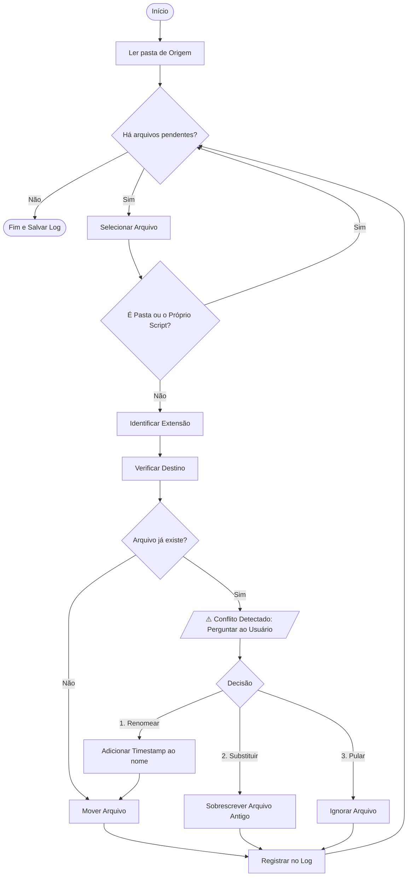

# 📂 Organizador de Arquivos Inteligente com Python

Este script automatiza a organização de diretórios (como a pasta Downloads), movendo arquivos para subpastas baseadas em suas extensões (ex: `.pdf`, `.jpg`, `.zip`).

Diferente de scripts simples, este projeto possui um **sistema de decisão interativo** para lidar com conflitos de arquivos duplicados e gera um **log detalhado** de todas as operações.

## 🚀 Funcionalidades

- **Classificação Automática:** Cria pastas automaticamente baseadas na extensão do arquivo.
- **Interativo:** Se um arquivo já existe no destino, você decide o que fazer:
  1.  **Renomear:** Salva com data e hora (ex: `documento_copia_09-01-2026_1430.pdf`).
  2.  **Substituir:** Sobrescreve o arquivo antigo.
  3.  **Pular:** Mantém o arquivo na origem.
- **Auditoria (Logs):** Gera um arquivo `log_mudancas.txt` com histórico de todas as movimentações e erros.
- **Segurança:** Ignora diretórios e arquivos de sistema para evitar quebras.

## 🛠️ Instalação e Dependências

Para rodar este script, você precisa apenas ter o Python instalado.

### 1. Instalando o Python

**Windows:**
1. Acesse [python.org/downloads](https://www.python.org/downloads/).
2. Baixe a versão mais recente (botão amarelo "Download Python 3.x.x").
3. **IMPORTANTE:** Ao iniciar o instalador, marque a opção **"Add Python to PATH"** antes de clicar em "Install Now".

**Linux (Ubuntu/Debian):**
Geralmente o Python já vem instalado. Para garantir, rode no terminal:
```bash
sudo apt update
sudo apt install python3
```

**macOS:**
O macOS já possui Python, mas recomenda-se instalar a versão mais recente via [python.org](https://www.python.org/downloads/) ou usando o Homebrew:
```bash
brew install python
```

### 2. Bibliotecas Necessárias
Este script foi projetado para ser leve e não requer instalação de pacotes externos via `pip`. As bibliotecas utilizadas são nativas da **Biblioteca Padrão do Python**:

* `shutil` (Para mover arquivos)
* `pathlib` (Para manipular caminhos de pastas de forma moderna)
* `datetime` (Para gerar registros de data e hora)

Isso significa que, se você tem o Python instalado, **já tem tudo o que precisa**.


## ⚙️ Configuração

Antes de executar, você deve configurar os caminhos das pastas no arquivo `auto_downloads.py`. Abra o arquivo em um editor de texto e altere as linhas iniciais:

```python
# Exemplo de configuração
pasta_origem = Path('/home/seu_usuario/Downloads') 
pasta_destino = Path('/home/seu_usuario/Downloads/para_organizar')
```

> **Nota para Windows:** Utilize o prefixo `r` antes das aspas para evitar erros com as barras invertidas, exemplo: `Path(r'C:\Users\SeuUsuario\Downloads')`.

## ▶️ Como Executar

1. Abra o terminal (ou Prompt de Comando/PowerShell) na pasta onde salvou o script.
2. Execute o comando:

```bash
python3 auto_downloads.py
# Ou, dependendo da sua instalação no Windows:
python auto_downloads.py
```

### Exemplo de Uso (Conflito)

```text
[!] CONFLITO ENCONTRADO: 'relatorio.pdf'
    Já existe um arquivo com este nome na pasta 'pdf'.
    [1] Renomear (Salva como '_copia_DATA')
    [2] Substituir (Apaga o antigo da pasta organizada)
    [3] Pular (Não faz nada)
      >>> Escolha uma opção (1-3): 1
[@] Renomeado para: relatorio_copia_09-01-2026_1500.pdf e movido.
```

## 📝 Estrutura Final das Pastas

```text
Downloads/
├── para_organizar/
│   ├── log_mudancas.txt  <-- Histórico de operações
│   ├── pdf/
│   │   ├── boleto.pdf
│   │   └── manual.pdf
│   ├── jpg/
│   │   └── foto.jpg
│   └── zip/
└── (arquivos não movidos)
```
## 📊 Fluxo de Funcionamento

O diagrama abaixo ilustra como o script toma decisões para cada arquivo encontrado:



## 🤝 Contribuição

Contribuições são bem-vindas! Sinta-se à vontade para abrir issues ou enviar pull requests.